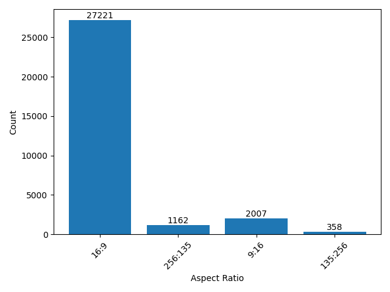

# Open-Sora-Dataset
<!--
[[Project Page]](https://pku-yuangroup.github.io/Open-Sora-Plan/) [[中文主页]](https://pku-yuangroup.github.io/Open-Sora-Plan/blog_cn.html)
-->
:bulb:  Welcome to the Open-Sora-Dataset project! As part of the [Open-Sora-Plan](https://github.com/PKU-YuanGroup/Open-Sora-Plan/) project, we specifically talk about the collection and processing of data sets. To build a high-quality video dataset for the open-source world, we started this project. 💪 

We warmly welcome you to join us! Let's contribute to the open-source world together! Thank you for your support and contribution. :heart:  

:bulb:  欢迎来到Open-Sora-Dataset项目！我们作为[Open-Sora-Plan](https://github.com/PKU-YuanGroup/Open-Sora-Plan/)项目的一部分，详细阐述数据集的收集和处理。为给开源世界构建一个高质量的视频数据，我们发起了这个项目。💪 

我们非常欢迎您的加入！让我们共同为开源的世界贡献力量！感谢您的支持和贡献。 :heart: 

<div style="display: flex; justify-content: center; align-items: center;"> 
   
</div>

## Data Construction for Open-Sora-Plan v1.0.0
### Data distribution
we crawled 40258 videos from open-source websites under the CC0 license. All videos are of high quality without watermarks and All videos are of high quality without watermarks, and about 60% of them are landscape data. The total duration is about **274h 05m 13s**The main sources of data are divided into three parts：
1. [mixkit](https://mixkit.co/): The total number of videos we collected is **1234**, the total duration is about **6h 19m 32s**, and the total number of frames is **570815**. The resolution and aspect ratio distribution histogram of the video is as follows (the ones that account for less than 1% are not listed)：

 

2. [pexels](https://www.pexels.com/zh-cn/): The total number of videos we collected is **7408** the total duration is about **48h 49m 24s** and the total number of frames is **5038641**. The resolution and aspect ratio distribution histogram of the video is as follows (the ones that account for less than 1% are not listed)：

   


3. [pixabay](https://pixabay.com/): The total number of videos we collected is **31616** the total duration is about **218h 56m 17s** and the total number of frames is **23508970**. The resolution and aspect ratio distribution histogram of the video is as follows (the ones that account for less than 1% are not listed):

   


### Dense captions
it is challenging to directly crawl a large quantity of high-quality dense captions from the internet. Therefore, we utilize a mature Image-captioner model to obtain high-quality dense captions. We conducted ablation experiments on two multimodal large models: [ShareGPT4V-Captioner-7B](https://github.com/InternLM/InternLM-XComposer/blob/main/projects/ShareGPT4V/README.md) and [LLaVA-1.6-34B](https://github.com/haotian-liu/LLaVA). The former is specifically designed for caption generation, while the latter is a general-purpose multimodal large model. After conducting our ablation experiments, we found that they are comparable in performance. However, there is a significant difference in their inference speed on the A800 GPU: 40s/it of batch size of 12 for ShareGPT4V-Captioner-7B, 15s/it of batch size of 1 for LLaVA-1.6-34B. We open-source all annotations [here](https://huggingface.co/datasets/LanguageBind/Open-Sora-Plan-v1.0.0). We show some statistics here, and we set the maximum length of the model to 300, which covers almost 99% of the samples.

| Name | Avg length | Max | Std |
|---|---|---|---|
| ShareGPT4V-Captioner-7B | 170.0827524529121 |  467 | 53.689967539537776 | 
| LLaVA-1.6-34B | 141.75851073472666 |  472 | 48.52492072346965 | 


## Video split
### Video with transitions
Use [panda-70m](https://github.com/snap-research/Panda-70M/tree/main/splitting) to split transition video

### Video without transitions
1. Clone this repository and navigate to Open-Sora-Plan folder
```
git clone https://github.com/PKU-YuanGroup/Open-Sora-Plan
cd Open-Sora-Plan
```
2. Install the required packages
```
conda create -n opensora python=3.8 -y
conda activate opensora
pip install -e .
```
3. Split video script
```
git clone https://github.com/PKU-YuanGroup/Open-Sora-Dataset
python split/no_transition.py --video_json_file /path/to/your_video --save_path /path/to/save
```

If you want to know more, check out [Requirements and Installation](https://github.com/PKU-YuanGroup/Open-Sora-Plan?tab=readme-ov-file#%EF%B8%8F-requirements-and-installation)

## Remove videos with text
```
cd ocr_process
python ocr_process.py -i /path/to/video
```

## Acknowledgement 👍
Qingdao Weiyi Network Technology Co., Ltd.: Thank you very much for providing us with valuable data
